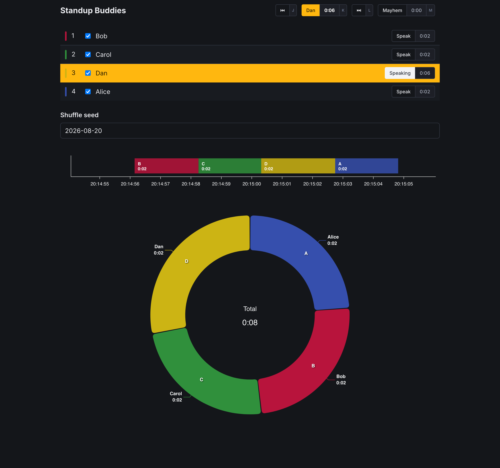

# Standup Buddies

A simple static page daily standup helper. [Live demo](https://czdanol.github.io/standup-buddies/)



- Shuffles the speaking order deterministically from a text seed (defaults to today's date).
- Tracks who is present.
- Times each speaker.
- Visualizes the meeting as it happens, with a timeline and a time-share donut chart.

Built with Svelte 5, TypeScript, Bulma and ApexCharts.
No backend, no external runtime dependencies — everything is bundled.

DISCLAIMER: This was an evening project with Claude. It was not vibe-coded, but I also wasn't as thorough as I usually am.

## Configuration

The team roster and page title live in `config.js` (gitignored).

1. Copy `config.example.js` to `config.js`.
2. Put your team in it.
   - See `types.ts` for configuration format.
   - Member `id`s must stay stable.
   - `pinned: true` places a member before the shuffled ones.

The config is also editable at the top of a built `dist/index.html` — no rebuild needed.

## Develop

```sh
npm install
npm run dev      # dev server with hot reload
npm run check    # type-check
```

## Build

```sh
npm run build    # type-checks, then emits a single self-contained dist/index.html
```

The build output is one HTML file with everything inlined.
Copy it anywhere — it works offline, even from file://.
